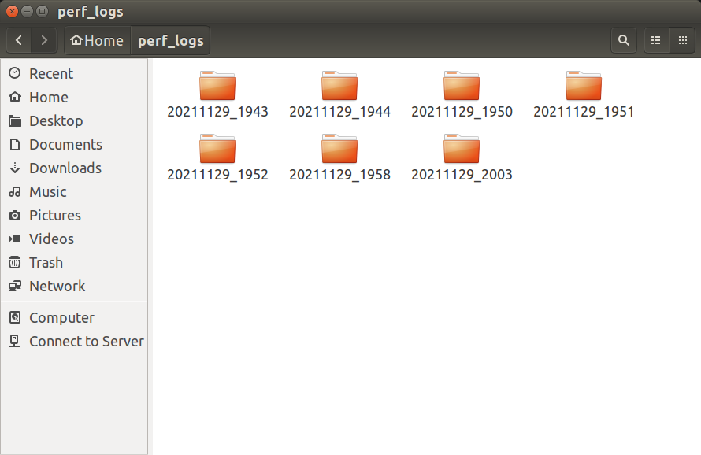
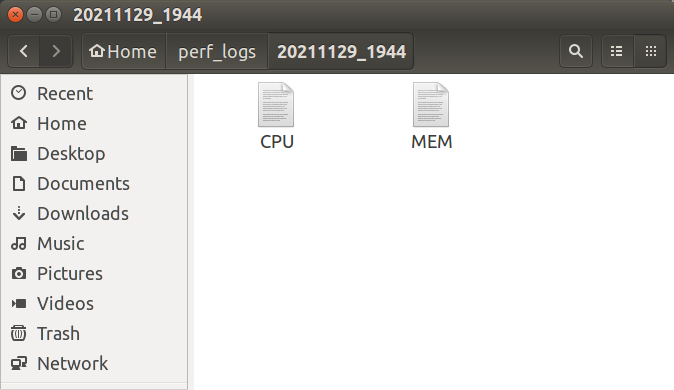
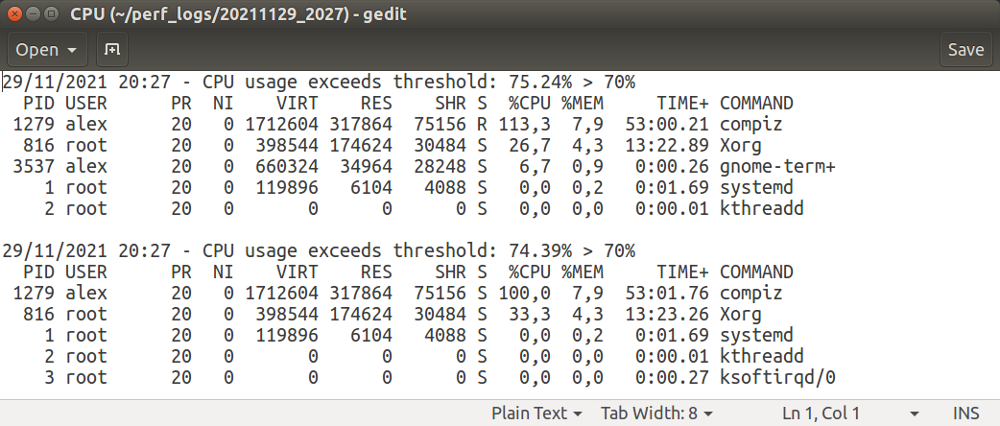
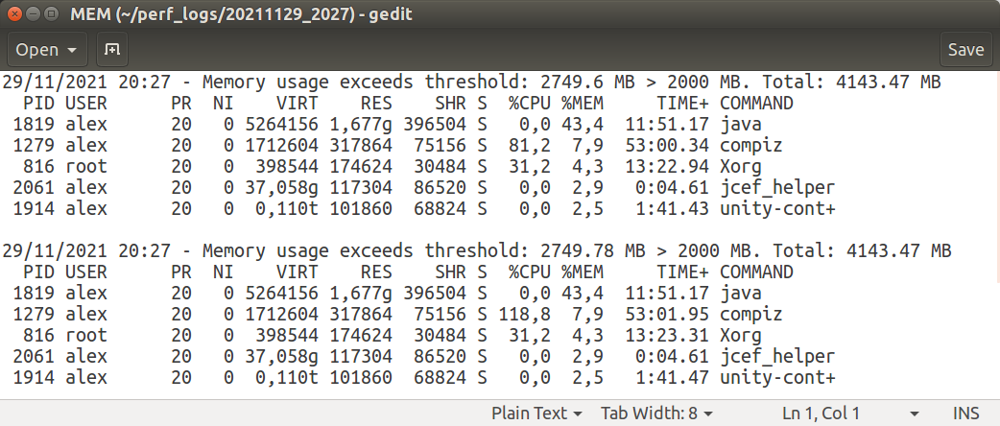

# PerformanceTracker
CPU &amp; RAM performance tracker for Linux

## Functionality
- Monitor CPU & RAM utilization in runtime for Linux OS
- When CPU/RAM usage is above the defined threshold, logs a file

## Usage
1. Clone the repository on your machine
2. Using Python 3, run the following command in the Linux terminal:
```
python3 /ScriptPath/PerformanceTracker.py
```
3. If no root directory is passed as an argument, the performance logs will be store in the PerformanceTracker.py directory

## Command and arguments
```
PerformanceTracker.py [-h] [-ct [[0-100]%]] [-mt [MBs]] [-ld [DIRECTORY]] [-pa [processAmount]]

optional arguments:
  -h, --help            show this help message and exit
  -ct [[0-100]%], --cputh [[0-100]%]
                        CPU usage percentage threshold. Default is 70
  -mt [MBs], --memth [MBs]
                        Memory usage MB threshold. Default is 3000 MB
  -ld [DIRECTORY], --logsdir [DIRECTORY]
                        Root directory for the logs to be stored. Ex: /home/userdir. Default is PerformanceTracker.py's directory
  -pa [processAmount], --pamount [processAmount]
                        Amount of processes to store in a log. Default is 5
```

## Log directories and files structure

- **Logs main directory**. A new subfolder is created each time the program is executed and stores the first log:


- **Logs subfolders**. Each subfolder can contain up to two log files, one for the CPU logs, and the other one for the Memory logs. Log files are created when the first log is filled for any of the components:


- **Log files**. Log files store the CPU/Memory usage in comparison to the threshold and a list of processes:
  - CPU logs store the processes that made the most use of the CPU at the time the log was added.
  
  - RAM logs store the processes that used the most memory at the time the log was added.
  